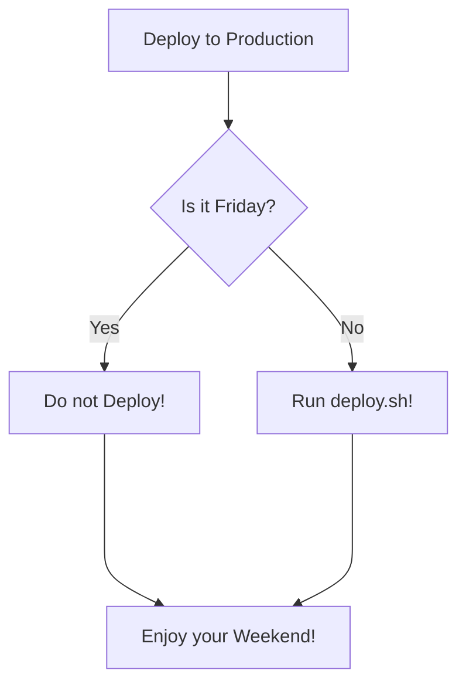

<p align="center">
 <a href="https://soloo.me">
 
 </a>
</p>
<h1 align="center">Backend Repository For Soloo Services</h1>

<div align="center">
TODO: Write the about here
</div>

  <p align="center">
    <br />
    <a href="https://developer.soloo.me/docs"><strong>Explore the docs »</strong></a>
    <br />
  <br/>
    <a href="https://github.com/bryanbill/soloo/issues">Report Bug</a>
    ·
    <a href="https://github.com/bryanbill/soloo/discussions">Request Feature</a>
    ·
    <a href="https://blog.soloo.me/">Read our blog</a>
  </p>
  
## Description
Soloo aims at providing backend solutions while also providing a hosted simple and intuitive interface for the frontend to get you started with the services offered. 
## Features

- Auth Service
- Storage Service
- Crashlytics Service
- Collaboration Platform
- Wallet Service
- App Center

## Install

<p>
Soloo uses CockroachDB as its database. Make sure you have CockroachDB installed and running on your machine.
</p>

### Clone the Repository

```bash
git clone https://github.com/bryanbill/soloo.git
```

### Install the dependencies

```bash
yarn install
```

### Run the migrations

```bash
yarn makemigrations && yarn migrations
```

### Deploying

## Enjoy!

Head over to [Api Documentation](https://localhost:4040/swagger) to get started
